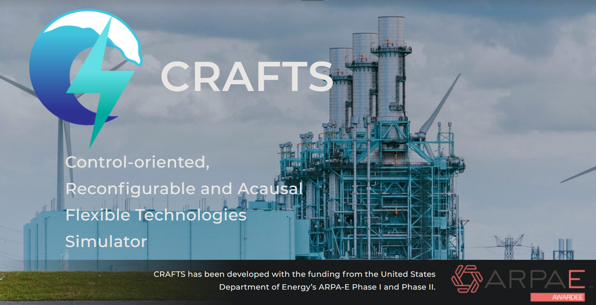
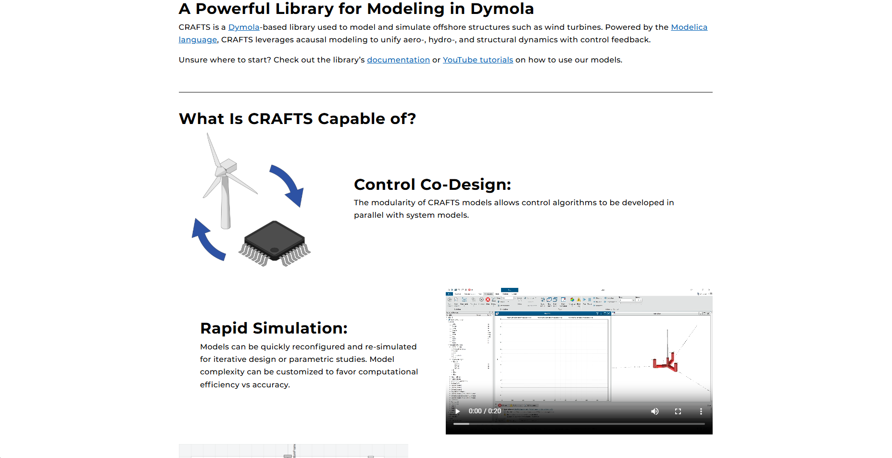
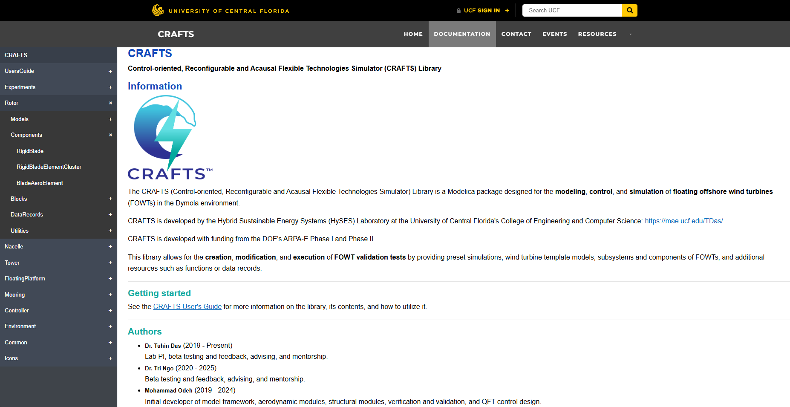
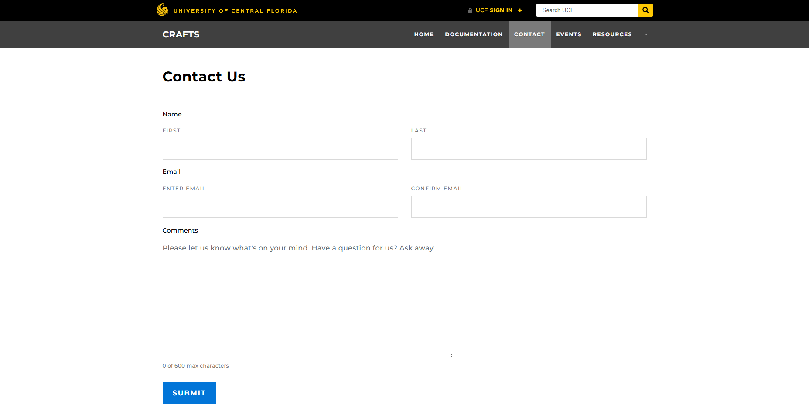
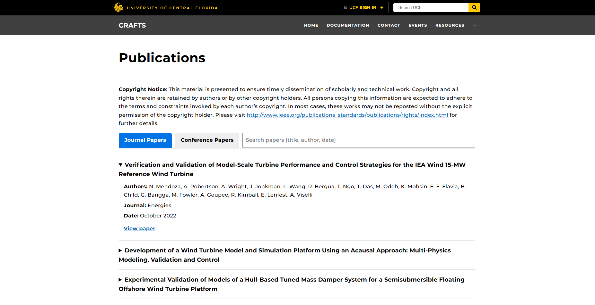
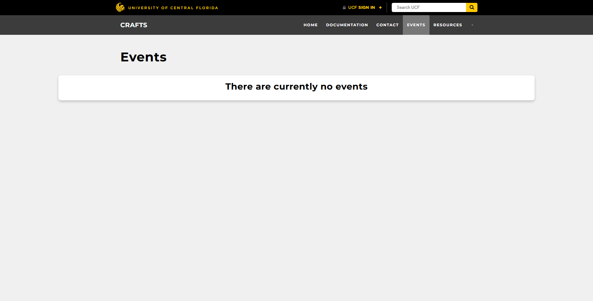
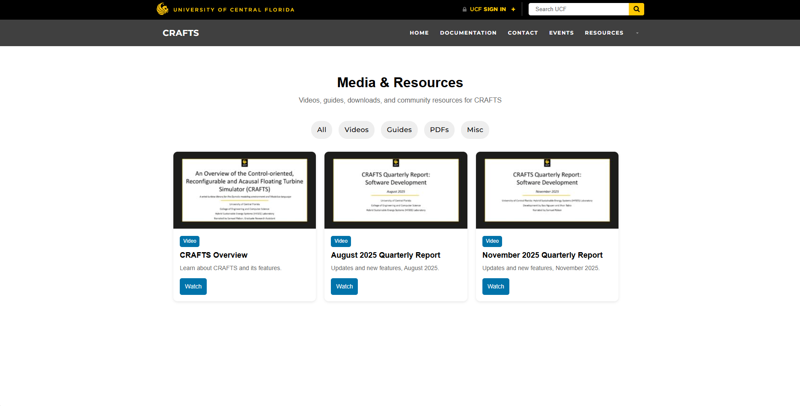

# CRAFTS Website

A customized WordPress platform built on top of the UCF WordPress theme with custom plugins, dynamic documentation systems, event subscription workflows, and content management features.

The CRAFTS website can be found [here](https://www.cecs.ucf.edu/crafts/)

---

## Overview

This project extends the base UCF WordPress theme into a customized platform designed to provide organized content delivery, documentation access, event communication workflows, and resource management functionality.

The work involved expanding functionality beyond the original theme capabilities by implementing custom plugins, dynamic content processing, and automated workflows while maintaining integration with the existing WordPress environment.

This project is publicly deployed under an official UCF domain.

---

## Project Goals

- Extend the existing UCF WordPress environment with functionality not available in the base theme
- Improve organization and discoverability of resources and documentation
- Automate communication workflows
- Create a scalable documentation system
- Build a maintainable content architecture

---

## Features

### Theme Customization

Modified the UCF WordPress theme directly to support project-specific requirements and functionality beyond the original implementation.

Implemented:

- New content structures
- Additional UI components
- Expanded functionality integrated into the existing environment

---

### Custom Documentation Plugin

Built a custom WordPress plugin from scratch to process and display Dymola documentation exports directly within the website.

The plugin:

- Parses document headers to generate navigation dynamically
- Sanitizes class names to avoid CSS conflicts
- Reroutes absolute/relative media paths
- Encapsulates rendered content within isolated containers
- Securely displays local documentation files
- Prevents unintended exposure of server-side content
- Supports large documentation exports containing hundreds to potentially thousands of files

Earlier versions used directory traversal for navigation generation but were later redesigned around document header parsing to create a cleaner and more maintainable structure.

---

### Event Subscription Workflow

Implemented an event notification workflow allowing users to subscribe to updates.

Features:

- Immediate email notifications
- Subscription workflows integrated into the site
- Event content integrated with WordPress content systems
- Automated communication process

---

### Publications and Media System

Built custom resource pages for publications and media management.

Implemented:

- Custom Post Types
- ACF-powered metadata structures
- Sorting functionality
- Client-side filtering
- Dedicated resource pages
- Custom display layouts

Client-side filtering was selected for simplicity and responsiveness with current content volume.

---

### Contact Routing System

Built custom contact workflows using Gravity Forms.

Features:

- Form routing to appropriate email destinations
- Streamlined communication processes
- Department-specific handling

---

## Technologies Used

### Core Technologies

- WordPress
- PHP
- JavaScript
- HTML
- CSS

### Plugins / Frameworks

- UCF WordPress Theme
- Advanced Custom Fields Pro (ACF Pro)
- Gravity Forms

### WordPress Features

- Custom Post Types
- Custom Metadata Fields
- Dynamic Content Rendering
- Form Handling
- Email Workflows

---

## Technical Challenges

### Dynamic Dymola Documentation Processing

#### Problem

Dymola documentation exports needed to be integrated into the WordPress environment while remaining:

- Lightweight
- Secure
- Navigable
- Isolated from site styling conflicts
- Maintainable as documentation changed

Potential issues included:

- CSS conflicts with existing site styles
- Exposure of local server content
- Navigation complexity
- Performance concerns
- Embedding limitations using iframes

---

#### Solution

Developed a custom plugin from scratch that:

- Processes local documentation exports
- Sanitizes class names
- Encapsulates documentation within custom containers
- Dynamically generates navigation through document header parsing
- Restricts exposed content to intended resources
- Integrates content directly into the website

The decision was made not to use iframes in order to maintain tighter integration with the site experience and improve flexibility.

---

#### Result

Created a documentation experience that behaves as a native component of the website while preserving security boundaries and reducing styling conflicts.

---

## My Contributions

This project was developed as a two-person effort.

My individual responsibilities included:

### Custom Development

- Built the documentation plugin from scratch
- Developed dynamic documentation navigation
- Processed and rendered Dymola export content
- Implemented class sanitization and content isolation
- Built publication and media systems
- Implemented filtering and sorting functionality
- Implemented event subscription workflows
- Built contact routing workflows
- Developed custom pages and layouts

### Content Architecture

- Created and managed Custom Post Types
- Configured ACF content structures
- Designed content organization workflows

### Theme Development

- Modified the UCF WordPress theme to extend functionality beyond its original capabilities

---

## Screenshots

### Homepage

### Documentation System

### Contact

### Publications

### Events

### Additional Resources

---

## Lessons Learned

Key takeaways from development:

- Designing custom functionality inside an existing framework introduces architectural tradeoffs
- Plugin separation improves maintainability compared to embedding all logic within themes
- Documentation rendering requires careful handling of security and content isolation
- Dynamic content systems become increasingly important as content volume grows
- Simple solutions often scale effectively before additional complexity becomes necessary

---

## Future Improvements

Potential future work:

- Server-side filtering or AJAX pagination for large datasets
- Search functionality across resources and documentation
- Additional user notification preferences
- Performance optimization
- Analytics dashboards
- Expanded documentation tooling

---

## Repository Notes

This repository serves as a project showcase and portfolio case study.

Source code is not included because portions of the implementation are tied to institutional WordPress infrastructure, deployment environments, and customized integrations.

This repository documents the architecture, design decisions, technical challenges, and development work involved in building the project
